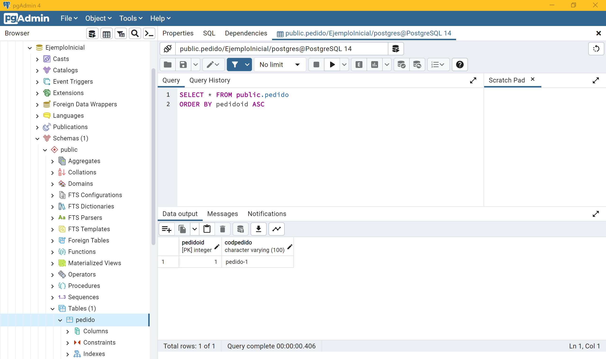

# Maven-Spring --> Ejemplo de consulta Insert (por consola, sin vistas)

# Introducción

Vamos a hacer un ejemplo práctico de consulta insert por consola (aún sin vistas) en un artefacto con spring framework.

**Nota**: consulta las dependencias del *pom.xml* antes de empezar... y recuerda hacer *maven install* y *update project*.

**Nota**: la BBDD tiene que estar creada previamente en PostgreSQL, pero la creación del esquema y de la tabla Pedido y sus columnas será automática con JPA e Hibernate (ya hicimos un ejemplo de esto en el repositorio de *maven-example-2*).

# 1. Creamos la arquitectura interna del proyecto

Creamos los paquetes:

- DAO
- implementation
- interfaces
- main
- controller  (lo usaremos más adelante)
- repository  (lo usaremos más adelante)
- service 	  (lo usaremos más adelante)

# 2. DAO --> PedidoDAO.java

```java
package DAO;

import java.io.Serializable;

import javax.persistence.Column;
import javax.persistence.Entity;
import javax.persistence.GeneratedValue;
import javax.persistence.GenerationType;
import javax.persistence.Id;
import javax.persistence.Table;

//Entity defines which objects should be persisted in the database
@Entity
//Defines the name of the table created for the entity
@Table(name = "Pedido")
public class PedidoDAO implements Serializable { // clase bean

	private static final long serialVersionUID = 1L;
	
	// ATRIBUTOS
	@Id
	@Column(name = "pedidoId", unique = true)
	@GeneratedValue(strategy = GenerationType.IDENTITY)
	private int pedidoId;
	
	@Column(name = "codPedido", length = 100, nullable = true)
	private String codPedido;
	
	
	// CONSTRUCTORES
	
	// constructor vacío
	public PedidoDAO() {
		super();
	}

		
	// GETTERS Y SETTERS
	public int getPedidoId() {
		return pedidoId;
	}

	public void setPedidoId(int pedidoId) {
		this.pedidoId = pedidoId;
	}

	public String getCodPedido() {
		return codPedido;
	}

	public void setCodPedido(String codPedido) {
		this.codPedido = codPedido;
	}

	public static long getSerialversionuid() {
		return serialVersionUID;
	}
}
```

# 3. interfaces --> PedidoInterface.java

```java
package interfaces;

import java.util.ArrayList;

import DAO.PedidoDAO;

public interface PedidoInterface {

	// Método que realizara una consulta de todos los datos de la tabla Pedido
	public ArrayList<PedidoDAO> selectPedidos();

	// Metodo que inserta un pedido con los parametros indicados
	public void insertPedido(String codPedido);
}
```

# 4. implementation --> PedidoServiceImpl.java

```java
package implementation;

import java.sql.Statement;
import java.sql.Connection;
import java.sql.ResultSet;
import java.sql.SQLException;
import java.util.ArrayList;

import javax.sql.DataSource;

import org.springframework.beans.factory.annotation.Autowired;
import org.springframework.stereotype.Service;

import DAO.PedidoDAO;
import interfaces.PedidoInterface;

@Service
public class PedidoServiceImpl implements PedidoInterface {
	
	// Atributos
	private DataSource dataSource;

	// Getters y Setters
	public DataSource getDataSource() {
		return dataSource;
	}
	
	public void setDataSource(DataSource dataSource) {
		this.dataSource = dataSource;
	}

	// Métodos
	
	/**
	 * método tipo select para obtener todos los objetos de tipo PedidoDAO de la tabla pedido de la BBDD
	 */
	@Override
	@Autowired
	public ArrayList<PedidoDAO> selectPedidos() {

		System.out.println("[INFO] Entrando en PedidoServiceImpl.selectPedidos()");
		String sql = "SELECT * FROM \"public\".\"pedido\"";
		ArrayList<PedidoDAO> listaPedidos = new ArrayList<PedidoDAO>();
		
		try {
			Connection conn = dataSource.getConnection();
			Statement statement = conn.createStatement();
			ResultSet resultSet = statement.executeQuery(sql);

			if (!resultSet.next()) {
				System.out.println("[INFO] -- La lista está vacía");
				return null;
			}

			while (resultSet.next()) {
				PedidoDAO pedido = new PedidoDAO();
				pedido.setPedidoId(resultSet.getInt("pedidoId"));
				pedido.setCodPedido(resultSet.getString("codPedido"));
				listaPedidos.add(pedido);
			}
			
			System.out.println("[INFO] -- Saliendo de PedidoServiceImpl.selectPedidos()");
			return listaPedidos;
			
		} catch (SQLException e) {
			// TODO Auto-generated catch block
			System.out.println("[ERROR] -- PedidoServiceImpl.selectEverything -- " + e.toString());
		}
		
		System.out.println("[INFO] -- Saliendo de PedidoServiceImpl.selectPedidos()");
		return null;
	}

	/**
	 * método tipo insert para añadir un objeto del tipo PedidoDAO a la tabla pedido de la BBDD
	 */
	@Override
	@Autowired
	public void insertPedido(String codPedido) {
		
		System.out.println("[INFO] -- Entrando en PedidoServiceImpl.insertPedido()");
		
		try {
			Connection conn = dataSource.getConnection();
			
			// Realizamos el insert
			Statement statement = conn.createStatement();

			String sql = "INSERT INTO \"public\".\"pedido\" VALUES(DEFAULT, \' " + codPedido + "\');";
			System.out.println(sql);
			
			statement.executeUpdate(sql);
			
		} catch (Exception e) {
			System.out.println("[ERROR] -- PedidoServiceImpl.insertPedido() -- " + e.toString());
			e.printStackTrace();
		}
		
		System.out.println("[INFO] -- Saliendo de PedidoServiceImpl.insertPedido()");
	}
}
```

# 5. src/main/resources --> bean.xml

```xml
<?xml version="1.0" encoding="UTF-8"?>

<beans 
	xmlns="http://www.springframework.org/schema/beans"
    xmlns:xsi="http://www.w3.org/2001/XMLSchema-instance"
    xmlns:context="http://www.springframework.org/schema/context"
    xsi:schemaLocation="http://www.springframework.org/schema/beans http://www.springframework.org/schema/beans/spring-beans.xsd
    http://www.springframework.org/schema/context http://www.springframework.org/schema/context/spring-context.xsd"
>

	<bean id="dataSource" class="org.springframework.jdbc.datasource.DriverManagerDataSource">
		<property name="driverClassName" value="org.postgresql.Driver"></property>
		<property name="url" value="jdbc:postgresql://localhost:5432/EjemploInicial"></property>
		<property name="username" value="postgres"></property>
		<property name="password" value="12345"></property>
	</bean>
	
	<bean id="pedido" class="implementation.PedidoServiceImpl">
		<property name="dataSource" ref="dataSource"></property>
	</bean>
 	
</beans>
```

# 6. main --> Main.java

```java
package main;

import java.util.ArrayList;
import java.util.Scanner;

import org.hibernate.SessionFactory;
import org.hibernate.boot.MetadataSources;
import org.hibernate.boot.registry.StandardServiceRegistry;
import org.hibernate.boot.registry.StandardServiceRegistryBuilder;
import org.springframework.context.ApplicationContext;
import org.springframework.context.support.ClassPathXmlApplicationContext;

import DAO.PedidoDAO;
import implementation.PedidoServiceImpl;

public class Main {
	
	// para pedir los datos al usuario por consola para probar el insert
	final static Scanner sc = new Scanner(System.in);
	
	public static void main(String[] args) {
		// TODO Auto-generated method stub

		// con los objetos registry y factory, activamos el archivo hibernate.cfg.xml para crear automaáticamente las tablas en la BBDD cuando ejecutamos el proyecto
		final StandardServiceRegistry registry = new StandardServiceRegistryBuilder().configure().build();
		SessionFactory factory = new MetadataSources(registry).buildMetadata().buildSessionFactory();
		
		/***************************************************************************************************************************/
		
		ApplicationContext applicationContext = new ClassPathXmlApplicationContext("bean.xml");
		PedidoServiceImpl pedido = (PedidoServiceImpl) applicationContext.getBean("pedido");

		System.out.println("\nIntroduzca un código de pedido para crear un nuevo pedido");
		String codPedido = sc.nextLine();
		
		pedido.insertPedido(codPedido);
		ArrayList<PedidoDAO> listaPedidos = pedido.selectPedidos();

		for (PedidoDAO p : listaPedidos)
			System.out.println(String.format("pedidoId = %d, codPedido = %s", p.getPedidoId(), p.getCodPedido()));
	}
}
```


